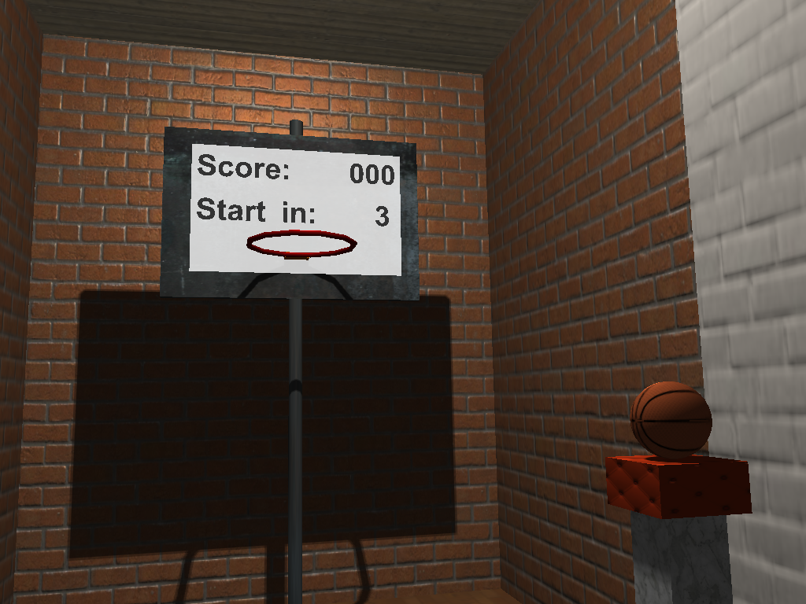
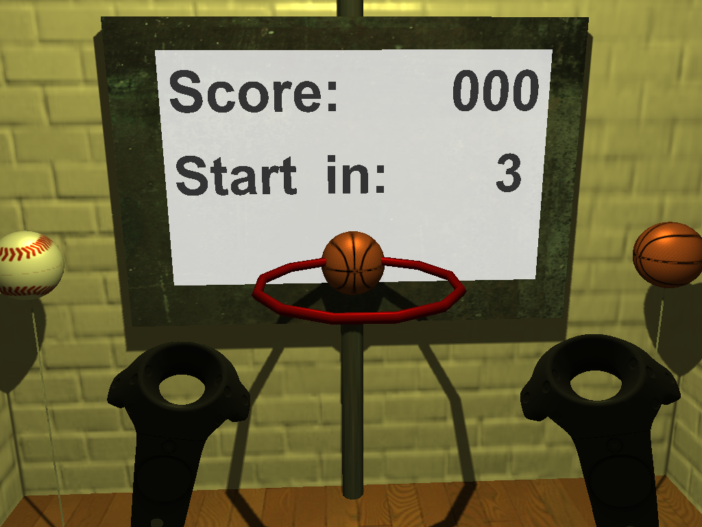

Basketball
==========

The Basketball project is a virtual reality game for the HTC Vive. You can grab a ball and throw it through a hoop. The aim is to get as many points as possible in the given time. There are multiple rounds with increasing difficulty.

How to Start
------------

 1. Start SteamVR and make sure all controllers are detected.
 2. Start Basketball.exe. (set the first command line parameter to 'true' if you want the short version with 2 rounds)
 3. Put on the head mounted display, controller loops and earphones.

How to Play
------------

 * Pull the trigger (at your pointing finger) when the controller is near the ball to grab it.
 * Release the trigger to throw the ball.
 * There are several rounds:
  1. The warm-up phase is free time to play around. The game starts after you scored 3 times.
  2. The hoop does not move. Each of the following rounds gives you 60 seconds to maximize your score. 
  3. The hoop jumps after each hit.
  4. The hoop moves from left to right and back.
  5. The hoop moves in a circle.
  6. The hoop moves in a circle twice as fast. Afterwards, your final score is displayed and you're back in the warm-up.

Grabbing Test
==========

The grabbing test is a virtual reality game for the HTC Vive. You get a point every time you throw the wanted ball through the hoop. The wanted ball, 1 out of 4, is displayed at the hoop. The aim is to get as many points as possible in the given time. There are multiple rounds with increasing difficulty.

How to Start
------------

 1. Start SteamVR and make sure all controllers are detected.
 2. Start GrabbingTest.exe directly or with command line parameter for certain types of feedback. There are .bat files in the solution directory for every combination of feedbacks.
 3. Put on the head mounted display, controller loops and earphones.

How to Play
------------

 * Pull the trigger (at your pointing finger) when the ball is within the selection volume to grab it. If enabled, haptic feedback (vibration) and optical feedback (highlight) show you if the ball can be grabbed.
 * Release the trigger to throw the ball.
 * The ball at the hoop shows which ball is required to score.
 * There are several rounds. The selection volume shrinks after each round approaching the controller's collidier.
 * The light is yellow during the warm-up phase. Also, there is a short green flash when a new round begins.

Pointcloud Editor
==========

The point-cloud editor is a virtual reality application for the HTC Vive. The aim of this application is to enable users to mark points. For example, you can select outliers and vegetation in laser scans of buildings. 

How to Start
------------

 1. Start SteamVR and make sure all controllers are detected.
 2. Start PointcloudEditor.exe directly or with command line parameters. The parameters are:
    1. Rendering quality: float, 0.0 - 1.0 (not used at the moment)
	  2. Pointset file: string, path + file name + extension to a pointset file; 1st line is number of points, other lines are: pos.x pos.y pos.z intensity red green blue
	  3. Reference operations file: string, path + file name + extension to an XML file containing the reference operations
	  4. Load reference: bool, should load the reference operations and compare the current selection with it, or save the current selection to the reference file
	  5. Storage path: string, path where the compressed cache of the pointset should be stored
	  6. Auto compare in sec: float, time after which the comparison is automatically performed; 0 to disable
 3. Put on the head mounted display and start

How to Use
------------

 * To rotate and move the point-cloud, hold the trigger of a controller down and move it. 
 * If you hold down the triggers of both controllers, you can also scale the pointcloud like with a pinch gesture from touch-screens. 
 * You can select and un-select points when pressing the trackpad left or right respectively. 
 * You can scale the selection volume when pressing the trackpad top or bottom. 
 * When you press the application menu button, your current selection is compared to the reference selection or your selection is saved as a future reference selection, depending on the command line parameters.
 * Comparison results are stored in 'bin\Release\output\'.

Notes
==========

How to Build
------------
 
 1. Get the source
    1. Open cmd in a new project folder
    1. git clone https://github.com/ErlerPhilipp/VR_DA.git
    2. git clone https://github.com/vrvis/aardvark.rendering.git
	3. cd aardvark.rendering
    3. git checkout philipp
 1. Install [OpenAL](https://www.openal.org/downloads/) if you haven't before
 1. Download dependencies and build
    1. Open a command line window in the VR_DA directory.
    3. Execute "build". The build script will now download and install the dependencies.
    4. The executables are created in "VR_DA\bin\Release\"
 1. Run in Visual Studio
    1. Open the solution in Visual Studio (2015).
    5. Set the desired project as start-up project.
    6. Build and run the application. Better start without debugger and attach later. Otherwise, the shader compilation can take more than 5 minutes.

Credits
------------
 * We use textures from http://www.textures.com/. The textures are converted to compressed formats.
  * http://www.textures.com/download/3dscans0045/127218
  * http://www.textures.com/download/substance0027/127027
  * http://www.textures.com/download/3dscans0029/126909
  * http://www.textures.com/download/3dscans0024/126738
  * http://www.textures.com/download/substance0021/126935
  * http://www.textures.com/download/substance0003/125731
 * Ball textures:
  * http://opengameart.org/content/basket-ball-texture
  * http://www.robinwood.com/Catalog/FreeStuff/Textures/TexturePages/BallMaps.html
 * Hoop model and textures:
  * http://tf3dm.com/3d-model/who-love-basketball--18784.html
 * Sound effects exported as wav with Microsoft encoding
  * Bounce (cut): https://www.freesound.org/people/Juan_Merie_Venter/sounds/327687/
  * Ambient 1: https://www.freesound.org/people/goulven/sounds/371277/
  * Ambient 2: https://www.freesound.org/people/PatrickLieberkind/sounds/245187/
  * Pop sound: https://www.freesound.org/people/qubodup/sounds/222373/
  * Sirene: https://www.freesound.org/people/santino_c/sounds/170825/
 * Pointcloud dataset by VRVis